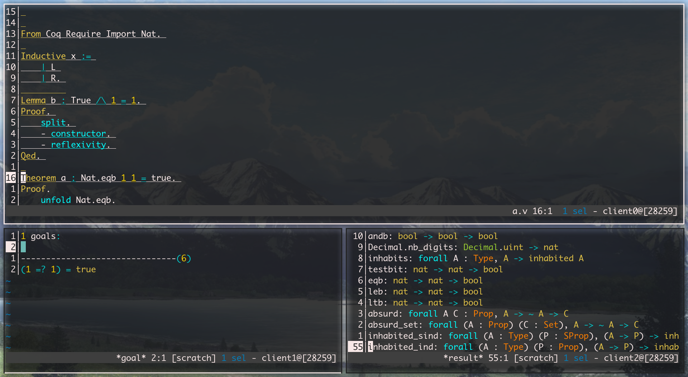

**WARNING: The shell script version of Coqoune is deprecated.
Please use the new OCaml version instead**

# Coqoune - CoqIDE meets Kakoune



Coqoune is a kakoune plugin for the Coq proof assistant,
featuring a CoqIDE-like experience with interactive goal & feedback display.

## 1. Installation

### Dependency
Coqoune is implemented using shell scripts,
so it should work on all *nix systems.
Note that coqoune uses several features not found in POSIX, like arrays.
So you must have one of zsh, bash or ksh installed to use coqoune.
But you don't have to use one of these as your user's shell.
Just have them in your `$PATH`, and coqoune will choose a suitable one.
However there are several runtime dependencies:

1. the coqidetop command
 
2. the xmllint command from libxml2
 
3. standard POSIX utilities 

These dependencies are generally installed on most systems with Coq installed.
However on some systems like nixos, where implicitly installed packages won't be in you `$PATH`,
you should install these dependecies (mostly `libxml2`) manually.

### Manual Installation
do
```
git clone https://github.com/guest0x0/coqoune
```
then in your kakrc
```
source /path/to/coqoune/rc/coqoune.kak
```
when you need coqoune (e.g. inside a filetype hook)

### Installation via plug.kak
```
plug "guest0x0/coqoune" subset %{
    coqoune.kak
}
```
You can config coqoune within plug.kak as well, see [the plug.kak repo](https://gitlab.com/andreyorst/plug.kak)


## 2. Usage
Coqoune facilities can be pulled in by calling `coq-start`.
The buffer where `coq-start` is called should be the coq file you want to edit with coqoune.
Once `coq-start` is called, two buffers,
`*goal*` and `*result*` will be created,
which displays proof goal and feedback message from Coq in respect.
You can open new kakoune clients to display them alongside the main buffer,
using i3, tmux or your tool of choice.

Note that only one coqoune instance can exist per kakoune session.

Once coqoune is started,
you can perform various commands provided by coqoune.
Before playing with these commands,
you should learn about how coqoune interact with Coq first.

The content of the Coq file won't be sent to Coq for processing
unless you ask coqoune to do so.
So coqoune, like CoqIDE, maintains a position in the Coq file, called `tip`.
Texts from start of buffer to the tip are already sent to Coq,
while texts behind the tip are not.
The region from start of buffer to the tip is called `processed`.
And the content of `*goal*` and `*result*` buffers are based on the `processe` region,
rather than the whole file.

By default, the `processed` region is underlined,
so that you can see it clearly.

Coqoune provides a set of commands for manupulating the `processed` region:

1.  `coq-next`: send the next complete Coq command,
starting from the tip, to Coq, growing `processed`.

2.  `coq-back`: undo the last sent command, shrinking `processed`.

3.  `coq-to-cursor`: place the tip on the end of the command where the main cursor is located.
Send/Undo commands, as well as growing/shrinking `processed`, if necessary.

Besides these commands, when you edit the main buffer,
coqoune shrink `processed` automatically so that no edit
will be inside `processed`,
i.e. you always need to re-send editted part again manually,
if they are already sent.

There are several other useful commands:

1.  `coq-query`: receive a string as the first parameter,
which contains a query to be sent to Coq, at current tip.
The query is just one or more ordinary Coq commands,
but these commands won't change the state (i.e. tip and `processed`)

2.  `coq-hints`: ask Coq for possible hints at current tip.

3.  `coq-dump-log`: receive a file name as the first parameter,
and dump coqoune log to the file (for debugging & trouble-shooting).


## 3. Configuration
The face `coqoune_processed` is used to highlight `processed` region.
By default it simply underline the region,
you can set it to alter the visual effect.

The option `coqoune_shell` is used to determine which shell is used to execute coqoune's scripts.
Available options are:

1. zsh

2. bash

3. ksh

These shells are tried from up to down, and the first available is used by default.
You can set the option manually to specify the shell to use.

For key-bindings, coqoune does not bundle any.
You also need to call `coq-start` somewhere manually.
Here's an example config:
```
hook global WinSetOption filetype=coq %{
    coq-start

    declare-user-mode coq

    map buffer user c ": enter-user-mode coq<ret>" \
        -docstring "enter the Coq user mode"

    map buffer coq c ": enter-user-mode -lock coq<ret>" \
        -docstring "stay in the Coq user mode"

    map buffer coq k ": coq-back<ret>" \
        -docstring "undo last sent command"

    map buffer coq j ": coq-next<ret>" \
        -docstring "send the next command to Coq"

    map buffer coq <ret> ": coq-to-cursor<ret>" \
        -docstring "move tip to main cursor"
}
```

## 4. Known Issues
Using `zsh` for `%opt{coqoune_shell}` seems to sometimes mess up the terminal after kakoune quits.
Using `bash` is fine and `ksh` is not tested.
A way to solve it is to type `reset` after quiting kakoune.
Technical details are in (#2).

## 5. License
This software is distributed under the zlib license.
